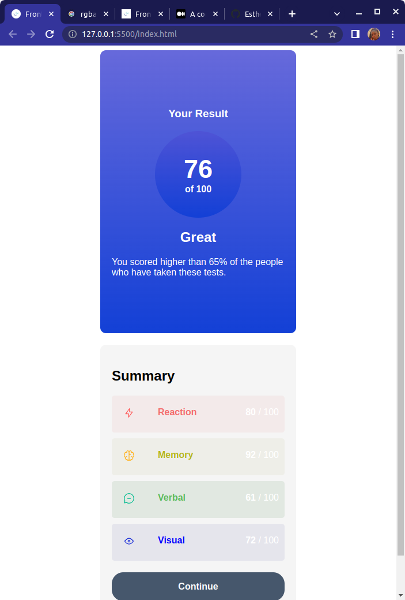
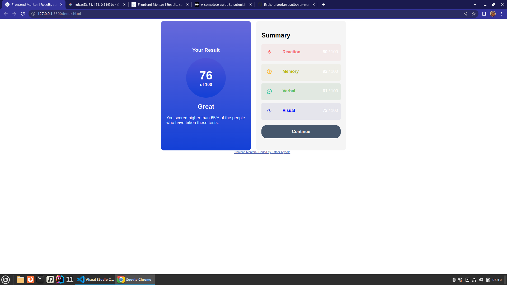

# Frontend Mentor - Results summary component solution

This is a solution to the [Results summary component challenge on Frontend Mentor](https://www.frontendmentor.io/challenges/results-summary-component-CE_K6s0maV). Frontend Mentor challenges help you improve your coding skills by building realistic projects. 

## Table of contents

- [Overview](#overview)
  - [The challenge](#the-challenge)
  - [Screenshot](#screenshot)
  - [Links](#links)
  - [Built with](#built-with)
  - [What I learned](#what-i-learned)
  - [Continued development](#continued-development)
- [Author](#author)

## Overview

### The challenge

Users should be able to:

- View the optimal layout for the interface depending on their device's screen size
- See hover and focus states for all interactive elements on the page

### Screenshot

### Links

- Solution URL: [Add solution URL here](https://your-solution-url.com)
- Live Site URL: [Add live site URL here](https://your-live-site-url.com)

### Built with

- HTML
- CSS

### What I learned

I learned a lot of css properties and css properties I had not used yet. Looking forward to doing better soon

### Continued development

I would want to make this website responsive in the future.

## Author

- Website - [Esther Aiyeola](https://www.your-site.com)
- Frontend Mentor - [@Estheraiyeola](https://www.frontendmentor.io/profile/yourusername)
- Twitter - [@esther-aiyeola](https://www.twitter.com/yourusername)
- GitHub - [@Estheraiyeola](https://www.twitter.com/yourusername)

